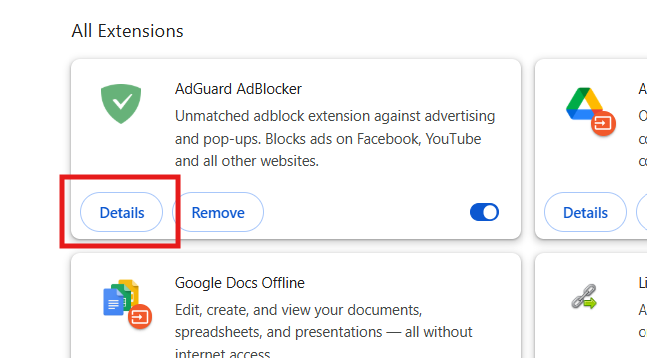

# Browser Extensions Security

### Step 1 – Open Browser’s Extension Manager
- Chrome → `chrome://extensions/`
- Firefox → `about:addons` → Extensions
- Brave → `brave://extensions/`

### Step 2 – Review Installed Extensions
- Look through all installed extensions.

- Compare with the [Malicious Extensions Examples](Suspicious%20Browser%20Extensions.md) file.
- Check developer, permissions, reviews, and ratings.

### Step 3 – Check Permissions & Reviews
- Just click on `Details` to see permissions and more.

- Watch for permissions like **“Read and change all your data on all websites”**.

- Read **negative reviews** on the store page.
    - Read 1-star reviews → often reveal hidden malware/ads.
- Verify if the **developer is known** and trusted.
- Look for excessive permissions (all-site access, browsing history, clipboard).

### Step 4 – Identify Suspicious Extensions
Mark extensions as:
- ✅ Safe – Trusted and verified.
- ⚠️ Suspicious – Extra permissions, unverified developer.
- ❌ Malicious – Known risks like ads, spyware, data theft.

#### ➡️ Online Security Scanners

- [CRXcavator](https://www.crxcavator.io) → Analyze Chrome extensions for risky permissions, outdated libraries, and suspicious behavior.

- [VirusTotal](https://www.virustotal.com) → You can upload .crx (Chrome extension file) or provide URLs to scan for malware.

- [Extension Monitor by 1Password](https://1password.com/extension-monitor/) → Checks if extensions are safe or have known vulnerabilities.

### Step 5 – Remove Suspicious/Unnecessary Extensions
- Remove ❌ and ⚠️ extensions immediately.

  
- Keep only ✅ safe ones.
- Remove unused extensions regularly.

### Step 6 – Restart Browser
- Restart your browser after removal.
- Check for speed improvements and fewer pop-ups.

---
### Risks of Malicious Extensions
- Data theft (passwords, credit cards, browsing history)
- Ad injection and pop-ups
- Redirects to scam websites
- Cryptocurrency mining in background

---

## ✅ How to Stay Safe
- Only install from **trusted publishers** with millions of users.
- Always check reviews and developer information.
- Avoid extensions that require **all-site access** unless absolutely necessary.
- Remove unused extensions regularly.
- Prefer open-source, **well-reviewed** alternatives.
